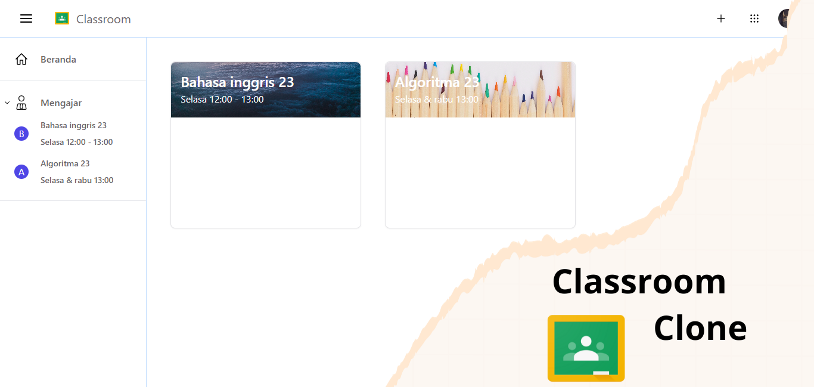

<h1 align="center"><strong>Classroom Clone</strong></h1>
<p align="center"><sub>Laravel Vue JWT Tailwind</sub></p>
<p align="center"><sub>Jangan lupa tekan 🌟</sub></p>

## Langkah untuk menggunakan classroom-clone

1. ```git clone https://github.com/insanXYZ/classroom-clone.git```
2. ```cd backend```
3. ```composer install```
4. ```npm install```
5. rubah ```.env.example``` menjadi ```.env```
6. buat database MySql anda dengan nama yang sama pada bagian ```DB_DATABASE``` pada ```.env```
7. ```php artisan key:generate```
8. ```php artisan storage:link```
9. ```php artisan migrate:fresh```
10. ```php artisan jwt:secret```
11. ```php artisan serve```
12. ```cd ../frontend```
13. ```npm install```
14. ```npm run dev```

## Fitur classroom-clone

1. Autentikasi
2. Buat kelas
3. Gabung kelas dengan code
4. Buat pengumuman kelas
5. Kirim file di pengumuman kelas